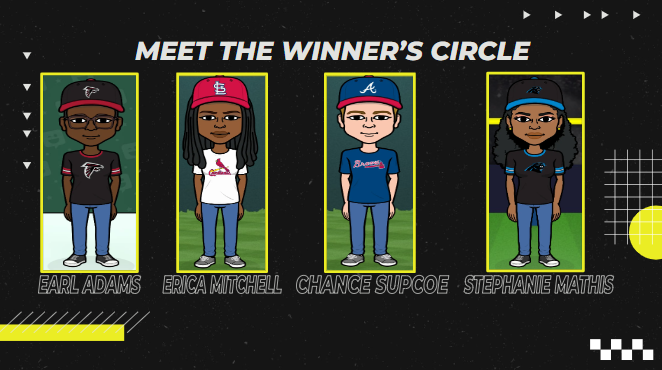

# Talk Sports App 

URL of Deployed Application:

URL of GitHub Repository: https://github.com/Bballplayer33/talk-sports-app

## Meet The Team
___________________________________________________________________________________________________________________________________

## GitHub Contact Information

* ericaLorraineMitchell https://github.com/ericaLorraineMitchell - Erica Lorraine Mitchell
* Sdm1984 https://github.com/Sdm1984- Stephanie Mathis
* ChanceSupcoe  https://github.com/ChanceSupcoe  - Chance Supcoe
* Bballplayer33  https://github.com/Bballplayer33 - Earl Adams

## User Story & Concept
* As an avid sports fan
* I want to chat with other fans in real-time about the latest scores, trades, players and trending topics
* So that I can not only meet new friends but share my knowledge and excitement with other like-minded people.

## Project Requirements
* Use React for the front end.
* Use GraphQL with a Node.js and Express.js server.
* Use MongoDB and the Mongoose ODM for the database.
* Use queries and mutations for retrieving, adding, updating, and deleting data.
* Use a polished UI.
* Be deployed using Heroku (with data)
* Be interactive (i.e., accept and respond to user input)
* Include authentication (JWT).
* Look professional and be mobile friendly.
* Protect sensitive API Key information on the server.
* Include a high-quality README (with a unique name, description, technologies used, screenshot, and link to deployed application).

## Presentation Link - https://docs.google.com/presentation/d/1nlVu9VXNgA1PwOTKEmHdzFpTvrvasNylPNUPWoDKrtU/edit#slide=id.gfab7020b52_0_107

## Mock-Up

## Credits
* Bitmoji - Bitmoji.com
* Globenewswire - Globenewswire.com
